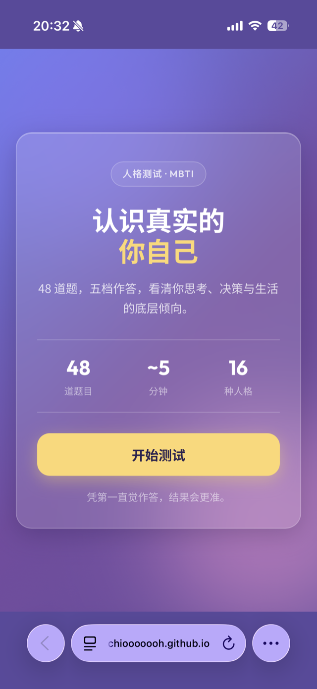
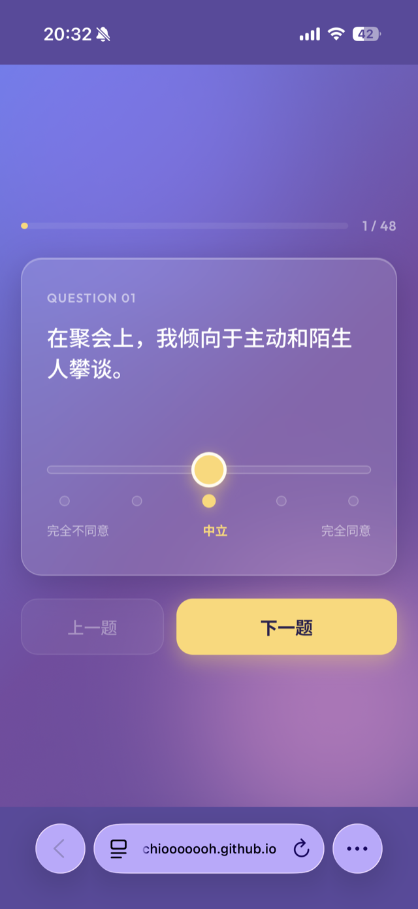
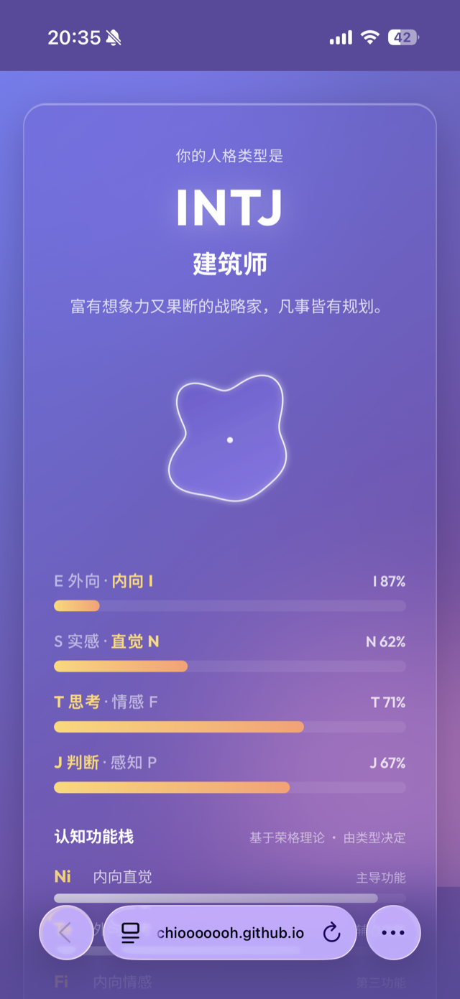
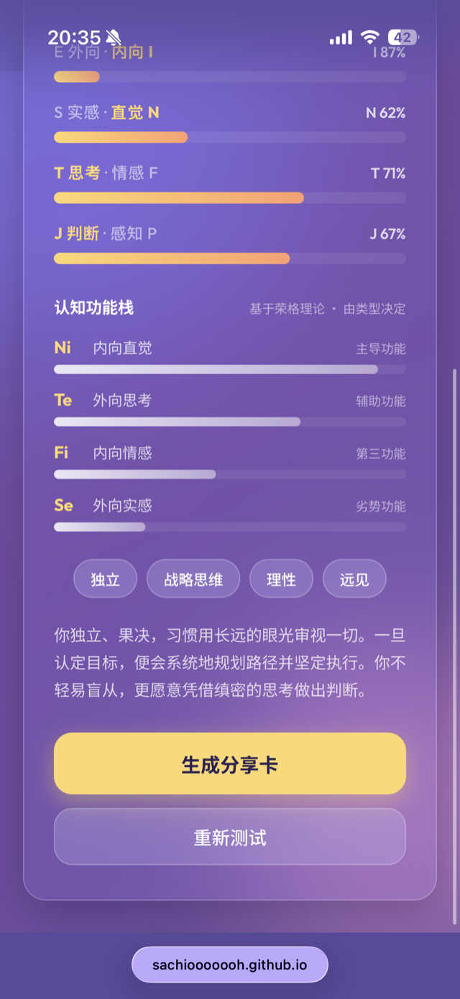
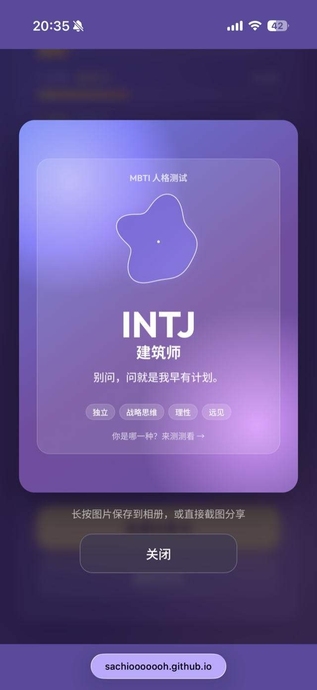

<div align="center">

# MBTI 人格测试

**一个手机端优先的玻璃拟态人格测试 —— 先有设计规范，再有代码。**

[](https://sachiooooooh.github.io/mbti-test/)

[](#)
[](#)
[](#)


</div>

> 阳光穿过磨砂玻璃落在桌面上 —— 一份让人愿意认真做完的人格测试。

---

## 📱 预览

<div align="center">

|  |  |  |
|:--:|:--:|:--:|
| **开始** | **答题 · 五档滑块** | **结果 · 专属图形** |

|  |  |
|:--:|:--:|
| **认知功能栈** | **一键分享卡** |

</div>

---

## ✨ 它是什么

一个纯前端的 MBTI 人格测试网页，专为手机端打造。紫蓝渐变 + 磨砂玻璃质感，48 道题用五档滑块作答，最后给出 16 型人格结果，并附三种可视化和一张可分享的卡片。

无后端、无框架、无第三方依赖 —— 打开浏览器就能跑。

## 🎯 特性

- **玻璃拟态视觉**：固定渐变背景 + 半透明磨砂卡片 + 漂浮柔光，移动端质感拉满
- **五档滑块作答**：李克特量表交互，拖动实时联动刻度点，比单纯点选更有"答得精确"的感觉
- **完整 48 题**：四个维度各 12 题，**正反向均衡出题**，降低"一味同意"的作答偏差
- **三层结果可视化**，各说一件事、互不冗余：
  - 📊 **四维偏向条** —— 你在 E/I、S/N、T/F、J/P 上各偏多少
  - 🌸 **专属人格图形** —— 由你**具体的作答数值**驱动生成的有机图形，均衡的人接近圆、偏向越极端起伏越大，每个人都不同
  - 🧠 **认知功能栈** —— 该类型的荣格认知功能顺序（主导 → 劣势）
- **一键分享卡**：用 Canvas 实时绘制 1080×1440 的 PNG，16 型各配一句传播向 slogan，长按即可保存
- **细节**：`prefers-reduced-motion` 降级、`100dvh` 规避移动端地址栏跳动、安全区适配、≥44px 触摸目标

## 🧭 设计驱动：先规范，再代码

这个项目最特别的地方，是它**不是直接写代码堆出来的**。

仓库里的 [`DESIGN.md`](./DESIGN.md) 是一份完整的设计规范 —— 色彩、字体、组件状态、布局、层次、动效、Do's & Don'ts、响应式、无障碍共 9 个章节，**先写规范、达成共识，再据此生成代码**。

这样做的好处：

- 视觉、动效、响应式有**统一的事实来源**，不靠"边写边拍脑袋"
- 规范可手改、可复用、可交接给其他人或工具
- 改设计先改 `DESIGN.md`，代码跟着规范走，避免越改越乱

> 对设计师来说，这是把"设计意图"显式固化下来的一种方式 —— 代码只是规范的忠实落地。

## 🚀 在线体验

**👉 [sachiooooooh.github.io/mbti-test](https://sachiooooooh.github.io/mbti-test/)**

手机扫码或直接打开即可，无需安装。

## 💻 本地运行

```bash
git clone https://github.com/sachiooooooh/mbti-test
cd mbti-test
python3 -m http.server 8000
# 浏览器打开 http://localhost:8000
```

> 直接用 `file://` 打开 `index.html` 也基本能用，但 Google Fonts 需要 HTTP 环境才能正常加载，建议起本地服务。

## 📂 项目结构

```
mbti-test/
├── index.html      # 三屏结构：开始 / 答题 / 结果 + 分享浮层
├── styles.css      # 玻璃拟态样式，严格落地 DESIGN.md
├── app.js          # 题库(48) + 计分 + 16型结果 + 专属图形 + 认知功能 + 分享卡
├── DESIGN.md       # 设计规范（先于代码产出）
└── README.md
```

## ⚖️ 关于结果的说明

本测试为**娱乐与自我探索向**，计分基于四维度李克特量表的简单累加，并非专业心理测评工具。其中「认知功能栈」依据荣格认知功能理论、**由最终类型查表得出**（同一类型的功能顺序固定），不是逐项实测值 —— 页面内也如实标注了这一点。

## 📄 License

可自由使用、修改、分发。

---

<div align="center">

用 ❤️ 和一份 `DESIGN.md` 做成

[在线体验](https://sachiooooooh.github.io/mbti-test/) · [设计规范](./DESIGN.md) · [报告问题](https://github.com/sachiooooooh/mbti-test/issues)

</div>
